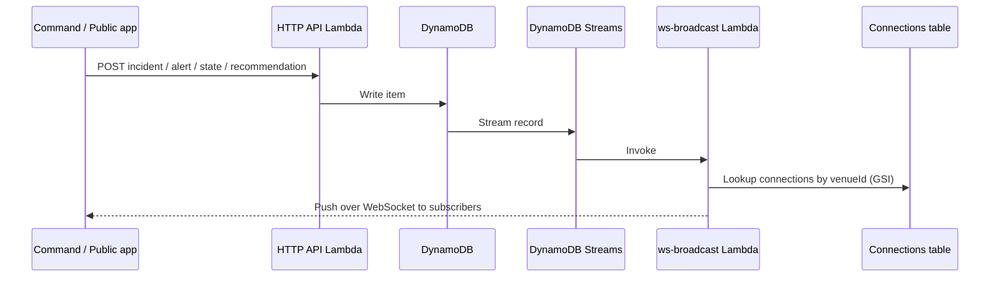

# 🛡️ CrowdShield

**AI-powered crowd safety and stampede-prevention platform for large public events — an iOS/macOS (and visionOS-capable) command app backed by a real-time serverless AWS backend.**

CrowdShield was built against a "TechNova" event-safety brief: predict crowd crushes and stampedes *before* they happen, guide operators to the right intervention, and keep the public informed — all without collecting a single frame of identifiable imagery. It ships two experiences in one app — a **Command & Control** console for safety officers and a **Public** safety companion for attendees — sharing one live venue state over WebSockets.

> Built independently by [@guguluP](https://github.com/guguluP), from SwiftUI client to AWS SAM backend.

---

## Table of Contents

- [Why CrowdShield](#why-crowdshield)
- [Feature Tour](#feature-tour)
- [Architecture](#architecture)
- [Tech Stack](#tech-stack)
- [Project Structure](#project-structure)
- [Getting Started](#getting-started)
  - [iOS/macOS App](#iosmacos-app)
  - [AWS Backend](#aws-backend)
- [Backend API Reference](#backend-api-reference)
- [The Prediction Engines](#the-prediction-engines)
- [Privacy & Ethics by Design](#privacy--ethics-by-design)
- [Testing](#testing)
- [Cost Model](#cost-model)
- [Roadmap](#roadmap)
- [License](#license)

---

## Why CrowdShield

Crowd crushes rarely happen because nobody was watching — they happen because the *warning signs* (rising density, reversing flow, a bottleneck quietly filling up) are scattered across too many feeds for a human to fuse in time. CrowdShield's core bet is that **stampede risk is predictable several minutes out** if you track density, movement speed, flow direction, and short-term trend together, instead of alerting on a single threshold.

The app is organized around two roles that see the same live venue through very different lenses:

| Role | Who | What they see |
|---|---|---|
| 🧭 **Command & Control** | Safety officers, control-room staff, first responders | Full dashboard: live risk map, stampede/panic predictions, evacuation routing, sensor ingestion, AI incident summaries, recommendation workflow |
| 👤 **Public** | Attendees, general public | Safety heat map, real-time alerts, one-tap incident reporting, multilingual assistant (prototype), safety guidance — zero operational or sensitive data |

Both roles are enforced **server-side** via Cognito group membership in the JWT (`require_command` on privileged mutations) — not just hidden in the UI.

Adaptive chrome: **iPhone** uses a role-aware `TabView`; **Mac** uses `NavigationSplitView` for a wider command layout. `SUPPORTED_PLATFORMS` also includes **visionOS** alongside iOS and macOS.

---

## Feature Tour

### For Command & Control
- **Live command dashboard** — overall venue risk, heuristic time-to-crush estimate, active zone count, and critical-zone flagging, updated over a real-time feed.
- **Stampede & panic prediction** — `RiskPredictionEngine` scores each zone's *stampede likelihood* and models how panic intensity would propagate across the venue's walkable graph, with the primary contributing signals surfaced per zone.
- **Evacuation routing** — `EvacuationRoutingEngine` computes the nearest-safe-exit path from any zone across a modeled venue graph (gates, plazas, stands, bottlenecks), so a recommendation isn't just "there's a problem here" but "send people this way."
- **Digital Twin** — a live 3D RealityKit scene where each venue zone is a column whose *height and color* both encode real-time risk, projected from the venue's actual geographic layout rather than an arbitrary mockup.
- **AI incident summaries** — one tap generates a natural-language command brief (headline, body, recommended next step) via a Bedrock (Claude) backend endpoint that uses a structured tool (`emit_summary`), with offline fallbacks: Apple Foundation Models, then a deterministic template — so officers are never left without a brief.
- **Recommendations workflow** — prioritized, typed action cards (open exit, close gate, redeploy staff, announce, redirect flow, change barricade) that officers acknowledge, with who/when tracked. Acting on a recommendation can apply **in-effect relief feedback** in the live simulation (density/flow adjustments that reflect the intervention).
- **Multi-venue support** — Command users can create new venues from the venue registry; both roles select from the live registry rather than a single hardcoded event.
- **Sensor ingestion abstraction** — pluggable `SensorSource` protocol (simulated, on-device Vision-based density estimation, crowd-sourced phone signal). **Today the Vision and crowd-sourced sources are stubs**; the live path uses the simulator so swapping to real sensors remains a source change, not a rewrite.

### For the Public
- **Live safety map** — real-time density heat map of the venue.
- **Real-time alerts** — pushed the moment Command issues one over WebSocket. Multilingual alert copy is **stubbed / prototype** (not a full translation pipeline yet).
- **Multilingual assistant** — lives under **Public** tabs (not Command): pre-vetted announcement phrases and speech synthesis for venue status; treat as an early prototype.
- **One-tap incident reporting** — location-tagged, with optional anonymity.
- **Privacy & Ethics screen** — the app's privacy commitments rendered as an in-app, user-facing surface (see below) — not just a policy document nobody reads.

### Cross-cutting
- **Real Cognito authentication** — sign up, email confirmation, sign-in, forgot/reset password, and silent session restore via Keychain-backed refresh tokens.
- **Offline-aware** — `OfflineSyncManager` monitors reachability so the app can degrade gracefully during venue network overload; queued delivery is a **prototype**, not a full offline sync store.
- **Alert debouncing** — a two-layer persistence + cooldown system (`AlertDebouncer`) so a single noisy sensor tick can't fire an alert, and a flickering condition can't spam the same alert repeatedly.
- **Liquid Glass UI** — adaptive `.glassEffect` on iOS/macOS 26+, with a graceful `.ultraThinMaterial` fallback on older OS versions, and role-aware accent theming (cyan for Public, amber for Command) throughout.
- **Live config** — the client ships pointed at deployed endpoints in `CrowdShieldConfig` (HTTP API, WebSocket, Cognito IDs).

> **Screenshots / diagram assets:** no app screenshots are checked in yet. Prior README revisions linked `docs/images/*.svg`, but those files are **not in the repository**, so diagrams below are textual (ASCII + Mermaid) instead of broken image links.

---

## Architecture

```
┌─────────────────────────────┐         ┌──────────────────────────────────────────┐
│   CrowdShield (SwiftUI)     │         │              AWS Backend (SAM)            │
│                              │         │                                            │
│  ┌────────────┐             │  HTTPS  │  ┌──────────┐    ┌─────────────────────┐  │
│  │ Public UI  │◄───────────►│────────►│  │ HTTP API │───►│ 11 Lambdas          │  │
│  ├────────────┤   REST/JSON │         │  │ (JWT     │    │ health · venue-state│  │
│  │ Command UI │             │         │  │ auth)    │    │ alerts · incidents  │  │
│  └────────────┘             │         │  └──────────┘    │ recommendations     │  │
│        ▲                    │         │                  │ venues · summary    │  │
│        │  WebSocket (live)  │  WSS    │  ┌──────────┐    │ post_confirmation   │  │
│        └────────────────────│────────►│  │WebSocket │    │ ws-connect/disc/bcast│ │
│                              │         │  │   API    │    └──────────┬──────────┘  │
│  On-device (offline path):  │         │  └────┬─────┘               │             │
│   • RiskPredictionEngine    │         │       │          DynamoDB (6 tables)     │
│   • EvacuationRoutingEngine │         │       ▼               │             │
│   • FlowAnalysisEngine      │         │  JWT verify on        DynamoDB Streams    │
│   • DigitalTwinProjection   │         │  $connect             │             │
│   • FoundationModels (AFM)  │         │       ▲              ws-broadcast Lambda  │
│                              │         │       └──────── pushes live changes ──────┘
└─────────────┬────────────────┘         │                                            │
              │                          │  Cognito User Pool (Public / Command groups)│
       CrowdSimulationService            │  Bedrock (Claude + emit_summary tool)       │
       (orchestrates everything,         │  CloudWatch Alarms → SNS email alerts       │
        drives the simulation tick)      └──────────────────────────────────────────┘
```

**Design principle:** every prediction engine on the client (risk, evacuation, flow, panic) works standalone on simulated/local sensor data, so the app is fully demoable offline. The AWS layer adds real auth, persistence, cross-device real-time sync, and a server-side LLM summary — but nothing about the safety logic *depends* on the network being up.

### How a change reaches every screen in real time

The most distinctive piece of the backend isn't any single Lambda — it's the DynamoDB Streams → broadcast fan-out that turns one write into a live update on every connected device, Public and Command alike, with no polling anywhere in the client:



This same path — write → stream → broadcast Lambda → connection lookup → push — drives live updates for **venue state, alerts, incidents, and recommendations**. WebSocket `$connect` **verifies the Cognito JWT** (`token` query param) before accepting the connection.

---

## Tech Stack

**Client**
- Swift 5, SwiftUI, Combine
- Targets iOS 26 / macOS 26 (Liquid Glass design system, Apple Foundation Models); visionOS listed in `SUPPORTED_PLATFORMS`
- RealityKit (Digital Twin 3D scene)
- Core Location, Vision, AVFoundation (speech), Network (reachability)
- Firebase (optional — gracefully no-ops if not linked via SPM)
- Native `URLSession`-based API/auth/realtime clients — no heavyweight networking dependency

**Backend**
- AWS SAM (CloudFormation under the hood), Python 3.12 Lambdas on `arm64` (**11** functions)
- Amazon Cognito (User Pool, Essentials tier, custom PostConfirmation trigger)
- Amazon API Gateway — HTTP API (JWT-authorized REST) **and** WebSocket API (real-time push with JWT verify on connect)
- Amazon DynamoDB (**6** tables, Streams-driven fan-out)
- Amazon Bedrock (Claude, cross-Region inference; structured `emit_summary` tool)
- Amazon CloudWatch Alarms + SNS (ops alerting)
- Amazon SES / SMS not used for end-user notifications by design (see [Cost Model](#cost-model))

---

## Project Structure

```
CrowdShield/
├── CrowdShield/                     # iOS/macOS app target
│   ├── CrowdShieldApp.swift         # App entry point, environment wiring
│   ├── ContentView.swift            # Root view / role routing (TabView vs NavigationSplitView)
│   ├── Models/
│   │   ├── CrowdModels.swift        # CrowdZone, RiskLevel, CrowdAlert, Recommendation, Venue…
│   │   ├── UserRole.swift           # UserRole enum + UserSession (auth/session state machine)
│   │   └── PrivacyPolicy.swift      # In-app privacy commitments (data, not just docs)
│   ├── Services/
│   │   ├── CrowdShieldAPIClient.swift        # REST client for the HTTP API
│   │   ├── CrowdShieldAuthService.swift      # Cognito sign-up/in/refresh/reset
│   │   ├── CrowdShieldRealtimeClient.swift   # WebSocket client for live push
│   │   ├── CrowdShieldConfig.swift           # Deployed stack endpoints/IDs (live)
│   │   ├── CrowdSimulationService.swift      # Orchestrator: ties engines + services together
│   │   ├── RiskPredictionEngine.swift        # Stampede likelihood + panic propagation (heuristic ETA)
│   │   ├── EvacuationRoutingEngine.swift     # Venue-graph shortest-safe-path routing
│   │   ├── FlowAnalysisEngine.swift          # Rolling-window trend detection
│   │   ├── DigitalTwinProjection.swift       # Lat/lon → 3D scene-space projection
│   │   ├── SensorIngestionService.swift      # Pluggable sources (sim live; Vision/crowd stubbed)
│   │   ├── FoundationModelsSummaryProvider.swift  # On-device AI summaries (Apple Intelligence)
│   │   ├── IncidentSummaryService.swift      # Summary protocol + offline template provider
│   │   ├── AlertDebouncer.swift              # Persistence + cooldown alert gating
│   │   ├── OfflineSyncManager.swift          # Reachability + delivery prototype
│   │   ├── KeychainStore.swift               # Secure refresh-token/email storage
│   │   ├── LocationManager.swift             # Core Location wrapper
│   │   └── HapticManager.swift               # Haptic feedback for alerts/actions
│   └── Views/                        # Dashboards, map, alerts, digital twin,
│                                      # multilingual assistant (Public), privacy, role/venue selection…
├── CrowdShieldTests/                 # XCTest sources (engines) — see Testing note
├── aws/                               # Serverless backend (AWS SAM)
│   ├── template.yaml                 # Infra-as-code: Cognito, API GW, 11 Lambdas, 6 DynamoDB tables, alarms
│   ├── samconfig.toml                # SAM CLI deploy configuration
│   ├── src/
│   │   ├── health/                   # GET /health
│   │   ├── venue_state/              # GET/PUT /venues/{id}/state
│   │   ├── alerts/                   # GET/POST /venues/{id}/alerts
│   │   ├── incidents/                # GET/POST /venues/{id}/incidents
│   │   ├── recommendations/          # GET/POST /venues/{id}/recommendations
│   │   ├── venues/                   # GET/POST /venues (registry)
│   │   ├── summary/                  # POST /venues/{id}/summary (Bedrock + emit_summary)
│   │   ├── post_confirmation/        # Cognito trigger — auto-assigns Public group
│   │   ├── ws_connect/ ws_disconnect/ ws_broadcast/   # WebSocket lifecycle + fan-out
│   │   └── shared/                   # Common helpers (JWT helpers, response shaping, require_command)
│   └── tests/                        # pytest unit tests (e.g. venue-slug generation)
└── CrowdShield.xcodeproj/
```

---

## Getting Started

### iOS/macOS App

**Requirements:** Xcode with iOS 26 / macOS 26 SDKs, a physical device or Apple Silicon Mac recommended (RealityKit Digital Twin and Apple Foundation Models features need real hardware, not the simulator).

```bash
git clone https://github.com/guguluP/CrowdShield.git
cd CrowdShield
open CrowdShield.xcodeproj
```

1. Build and run the `CrowdShield` scheme.
2. The app ships pointed at a live deployed backend (see `CrowdShieldConfig.swift`) — you can run it immediately against that stack, or deploy your own (below) and update the constants there.
3. Firebase is optional: the app checks `#if canImport(FirebaseCore)` and simply skips initialization if the SDK isn't linked — no crash, no required setup.
4. Sign up as a **Public** user directly in-app (self-signup → email confirmation → auto-added to the `Public` Cognito group). **Command** accounts are provisioned manually (by design — see [Backend API Reference](#backend-api-reference)); add a user to the `Command` group via the Cognito console or CLI to test that role.

### AWS Backend

The backend is a complete AWS SAM application. Deploying your own stack is optional — the app already points at a live one — but useful if you want your own data, your own Bedrock quota, or to extend the API.

**Prerequisites**
- An AWS account
- [AWS CLI v2](https://docs.aws.amazon.com/cli/latest/userguide/getting-started-install.html), configured (`aws configure`)
- [AWS SAM CLI](https://docs.aws.amazon.com/serverless-application-model/latest/developerguide/install-sam-cli.html)
- Bedrock model access enabled for the Claude model referenced in `template.yaml` (`BedrockModelId` parameter), if you want AI summaries

```bash
cd aws
sam build
sam deploy --guided
```

On subsequent deploys:

```bash
sam build && sam deploy
```

SAM prints stack **Outputs** when it finishes — `ApiEndpoint`, `WebSocketUrl`, `UserPoolId`, `UserPoolClientId`, and per-resource URL templates. Copy the relevant ones into `CrowdShield/Services/CrowdShieldConfig.swift`.

**Quick health check:**

```bash
curl "$(aws cloudformation describe-stacks \
  --stack-name crowdshield-phase1 \
  --query "Stacks[0].Outputs[?OutputKey=='HealthUrl'].OutputValue" \
  --output text)"
```

**Tear down:**

```bash
sam delete --stack-name crowdshield-phase1
```

> The `aws/README.md` and `aws/README-UPDATE.md` files in this repo capture the incremental deploy history (Phase 1 foundation → later phases) in more granular detail, including console-only update steps if you don't have the SAM CLI handy.

---

## Backend API Reference

All routes are served from one HTTP API (`AWS::Serverless::HttpApi`), JWT-authorized against the Cognito User Pool by default; `/health` is the only public, unauthenticated route. Command-only mutations are enforced in Lambda with `require_command` (Cognito `Command` group), not only in the UI.

| Method | Path | Auth | Notes |
|---|---|---|
| `GET` | `/health` | None | Liveness + DynamoDB connectivity check |
| `GET` / `PUT` | `/venues/{venueId}/state` | Any authenticated user | Live crowd/venue state |
| `GET` / `POST` | `/venues/{venueId}/alerts` | Any authenticated (POST is Command-only, enforced in code) | |
| `GET` / `POST` | `/venues/{venueId}/incidents` | Any authenticated user may POST | Public incident reporting |
| `GET` / `POST` | `/venues/{venueId}/recommendations` | Any authenticated (POST is Command-only, enforced in code) | |
| `GET` / `POST` | `/venues` | Any authenticated (POST is Command-only, enforced in code) | Venue registry; `POST` creates a venue and derives its slug `venueId` |
| `POST` | `/venues/{venueId}/summary` | Any authenticated user | Bedrock-generated incident summary via structured `emit_summary` tool |

**Real-time:** connect to `wss://{WebSocketApi}/{stage}?token=<Cognito ID token>&venueId=<venue id>`. The backend **verifies the JWT on `$connect`**, tracks the connection in DynamoDB (with a `byVenue` GSI), and a dedicated broadcast Lambda — driven by DynamoDB Streams off the venue-state, alerts, incidents, and recommendations tables — pushes every change to every connection subscribed to that venue.

**Role enforcement:** Cognito groups (`Public`, `Command`) are embedded in the JWT. Self-signup always lands a user in `Public` via a `PostConfirmation` Lambda trigger; `Command` is never auto-assigned and must be granted manually — there is deliberately no self-service path to operator access.

**Tables (6):** venues, venue-state, alerts, incidents, recommendations, connections.

**Lambdas (11):** health, venue_state, alerts, incidents, recommendations, venues, summary, post_confirmation, ws_connect, ws_disconnect, ws_broadcast.

---

## The Prediction Engines

CrowdShield's headline claim — *predicting* stampede risk rather than reacting to it — lives in a small set of composable engines. These are **rule/heuristic engines**, not trained ML models: the "minutes to crush" figure is a **heuristic ETA** derived from density, mobility, flow anomalies, and short-term trend — useful for operators, not a black-box forecast.

- **`FlowAnalysisEngine`** keeps a rolling history (last 8 samples) per zone and computes density trend (people/m² per second). This is what turns "density is high" into "density is high **and rising fast**" — the actual leading indicator.
- **`RiskPredictionEngine`** combines density, mobility collapse, flow anomalies, and that trend into an explicit `StampedePrediction` (0–1 likelihood, primary drivers, estimated minutes-to-critical) per zone, plus a `PanicState` that models how panic intensity seeds and spreads across the venue's connectivity graph.
- **`EvacuationRoutingEngine`** walks a modeled `VenueGraph` (gates, plazas, stands, bottlenecks, and their real connectivity/distances) to compute the nearest safe-exit path from any zone — so every high-risk reading can be paired with an actionable route, not just a warning.
- **`DigitalTwinProjection`** turns each zone's real (lat, lon) into a flat, geographically-accurate 3D scene position (equirectangular-style local projection), which `DigitalTwinView` then renders live in RealityKit with column height and color both driven by current risk.
- **`AlertDebouncer`** sits on top of all of the above: a condition needs to persist for multiple consecutive ticks before it's treated as real, and once an alert fires for a given key it won't re-fire again until a cooldown elapses — directly addressing false-alarm fatigue rather than leaving every engine to reinvent its own noise filter.

All of this runs identically whether the underlying zone data comes from the built-in simulator or (when wired) other `SensorSource` implementations — see `SensorIngestionService`. Vision and crowd-sourced sources are currently stubbed.

---

## Privacy & Ethics by Design

Crowd-safety systems live or die on public trust, so CrowdShield treats privacy as a first-class, user-visible feature (`PrivacyEthicsView`), not a buried policy page:

- **No raw imagery ever leaves the device** — on-device Vision-based density estimation (when enabled) is designed to process frames in memory and discard them immediately.
- **No facial recognition or identity tracking** — people are counted as anonymous bounding boxes for density/flow only.
- **Aggregate numbers only** cross the network — density, speed, flow direction, risk score. None of it can be reversed into an image or an identity.
- **Citizen reports are opt-in and can be anonymous.**
- **Minimal retention** — zone telemetry is kept only as a short rolling window needed for trend prediction.
- **Compliant by design** — architecture avoids collecting PII by default, in line with data-minimization principles under India's Digital Personal Data Protection Act, 2023.

---

## Testing

- **Swift (XCTest)** — `CrowdShieldTests/` contains unit tests for the alert debouncer's persistence/cooldown logic, the digital twin's geographic projection math, and the evacuation routing engine's pathfinding over the venue graph. **Note:** the test *sources* exist, but the XCTest target is **not currently wired into** `CrowdShield.xcodeproj`, so Xcode's Test navigator / `xcodebuild test` will not pick them up until the target is added.
- **Python (pytest)** — `aws/tests/` covers backend logic such as venue-name-to-slug generation for the venue registry. Run with `pytest aws/tests/`.

---

## Cost Model

The backend is deliberately architected to stay inside AWS's Always Free tier for demo-scale traffic:

- No EC2, NAT Gateway, RDS, or SMS.
- DynamoDB tables are provisioned well under the free 25 RCU/WCU (5/5 each across the six tables).
- Cognito Essentials tier: free for typical demo MAU volumes.
- Lambda runs on `arm64` at 128 MB — cheapest available compute shape.
- TTL is enabled on time-bounded tables (alerts, incidents, connections) so demo data doesn't accumulate indefinitely.
- CloudWatch Alarms feed a single SNS topic with email delivery — no per-message SMS cost.

The only paid-by-design piece is Bedrock model invocation for AI summaries, which is pay-per-request and only triggered on demand.

---

## Roadmap

Ideas that fit naturally into the existing architecture but aren't finished yet:

- Wire Vision / crowd-sourced `SensorSource` implementations beyond stubs; real venue sensor integrations
- Complete multilingual alert translation (beyond the current stub) and harden the Public multilingual assistant
- Finish offline queued delivery beyond the current `OfflineSyncManager` prototype
- Add the XCTest target to the Xcode project so `CrowdShieldTests` run in CI
- Restore or regenerate architecture diagram assets under `docs/images/` (or keep Mermaid as source of truth)
- Historical analytics / post-event reporting beyond the current rolling-window retention
- Push notifications (APNs) layered on top of the existing WebSocket channel for background alerting
- Passkey (WebAuthn) sign-in once an Apple Developer Program Associated Domains entitlement and hosting are in place (the Cognito user pool is already provisioned on the Essentials tier that supports it)

---

## License

No license file is currently published at the repository root — until one is added, all rights are reserved by the author. Open an issue or contact [@guguluP](https://github.com/guguluP) if you'd like to use this project beyond personal reference.
